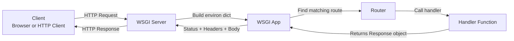
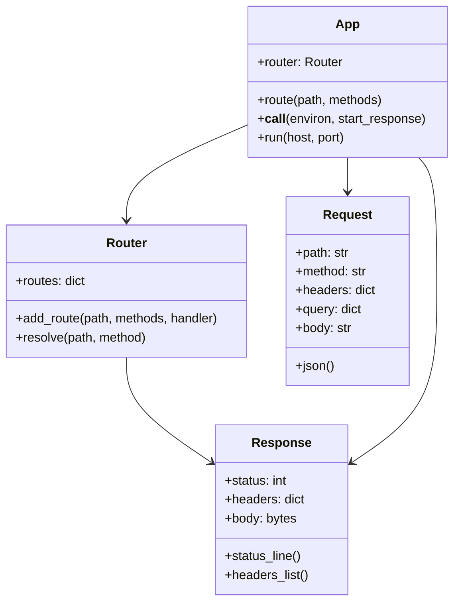

# Введение

Данный проект представляет собой небольшой веб-фреймворк на Python, который реализован через стандартные библиотеки.

**Цель проекта** — симулировать работу реального веб-сервера и предоставить минимальную реализацию веб-фреймворка, необходимую для создания пользовательских веб-приложений. По своей сути проект представляет собой упрощенный аналог полноценных промышленных веб-фреймворков, используемых в промышленной разработке, таких как: Django, Flask и Gunicorn.

Основной объектом проекта станет App, который объединит в себе маршрутизатор, обработчики запросов и WSGI-интерфейс , обеспечивая удобный для пользователя API для создания веб-приложений.

## Основные задачи проекта:

- Реализация простого WSGI-совместимого сервера, способного обрабатывать HTTP-запросы и формировать корректные ответы.
- Создание класса `App` — центрального объекта приложения, через который пользователь регистрирует маршруты, управляет обработчиками и запускает сервер.
- Создание системы маршрутизации (Router), которая сопоставляет путь и метод запроса с обработчиком.
- Разработка класса Request для удобного доступа к query-параметрам, заголовкам и телу запроса (включая JSON).
- Разработка класса Response для формирования HTTP-ответов с различными статус-кодами, заголовками и телом.
- Написание тестов, для тестирования полученного веб-фреймворка. 
- Реализации должна строиться на основах ООП, а также соответствовать принципам "чистой архитектуры"

## Принцип работы веб-фреймворка

Далее поговорим о принципе работы веб-фреймворка:

1. **Клиент**  
   - Некоторый клиет отправляет HTTP-запрос на сервер.  

2. **WSGI сервер**  
   - Сервер принимает запрос и формирует словарь `environ` с информацией о запросе (метод, путь, заголовки, тело запроса) в сооветсвии со стандартом WSGI.  
   - Этот словарь передаётся приложению (`App`).  

3. **Приложение**  
   - Получает словарь `environ` и начинает обработку запроса.  
   - Ищет подходящий маршрут в системе маршрутизации (`Router`).  
   - Если маршрут найден, вызывает соответствующую функцию-обработчик (`Handler`).  

4. **Обработчик**  
   - Обрабатывает запрос, получает данные из `Request` (query-параметры, JSON, заголовки).  
   - Формирует объект `Response`, содержащий статус-код, заголовки и тело ответа.  

5. **Возврат ответа через App**  
   - App получает объект `Response` от Handler.  
   - Преобразует его в формат, который понимает WSGI сервер (status line, заголовки, тело).  

6. **WSGI сервер отправляет HTTP-ответ клиенту**  
   - Сервер возвращает готовый HTTP-ответ обратно клиенту, который видит результат запроса.  

### Подробнее о задачах (планируемая реализация классов)

### App
**Назначение:** Центральный объект приложения, объединяющий маршрутизацию, обработку запросов и запуск сервера.

**Атрибуты:**
- `router` – объект Router для хранения маршрутов и поиска обработчиков.

**Методы:**
- `route(path, methods)` – декоратор для регистрации маршрутов с указанными HTTP-методами и обработчиком.
- `__call__(environ, start_response)` – точка входа WSGI; принимает словарь запроса, вызывает Router, получает Response и возвращает его серверу.
- `run(host, port)` – запускает WSGI сервер на указанном хосте и порте.
- 
### Router
**Назначение:** Сопоставляет URL и HTTP-метод с соответствующим обработчиком (Handler).

**Атрибуты:**
- `routes` – словарь, где ключ — путь и метод, значение — функция-обработчик.

**Методы:**
- `add_route(path, methods, handler)` – добавляет маршрут с соответствующими методами.
- `resolve(path, method)` – возвращает функцию-обработчик для заданного пути и метода;

### Request
**Назначение:** Объект запроса, упрощающий работу с данными HTTP-запроса.

**Атрибуты:**
- `path`, `method`, `headers`, `query`, `body` – данные запроса.

**Методы:**
- `json()` – парсит тело запроса как JSON и возвращает словарь.

### Response
**Назначение:** Объект ответа, формируемый обработчиком и возвращаемый клиенту.

**Атрибуты:**
- `status` – HTTP-статус код.
- `headers` – словарь заголовков ответа.
- `body` – тело ответа в байтах.

**Методы:**
- `status_line()` – возвращает строку статуса в формате WSGI (`"200 OK"`).
- `headers_list()` – возвращает заголовки в формате списка, понятном WSGI серверу.

## Пользовательский опыт:

Пользователь фреймворка получает иметацию базового интерфейса для создания веб-приложений:

- Создание приложения через объект `App`.
- Регистрация маршрутов через декораторы или методы приложения.
- Получение данных запроса через объект `Request`.
- Формирование ответов через объект `Response`.
- Быстрый запуск локального сервера для обработки запросов.

## Сроки реализации:

### 1. Реализация WSGI-сервера (1-я неделя)

- Написать минимальный сервер, который принимает HTTP-запросы и формирует `environ`.
- Подключить `App` как WSGI-приложение.
- Добавить обработку статуса, заголовков и тела ответа.

### 3. Реализация App (1-я неделя)

- Создать класс `App`.
- Подключить маршрутизатор (`Router`) и возможность регистрации маршрутов.

### 4. Реализация Router и Handler (2–я неделя)

- Реализовать `Router` для сопоставления URL и HTTP-методов с обработчиками.
- Реализовать метод для поиска нужного обработчика.
- Вызов обработчика и возврат `Response`.

### 5. Реализация Request и Response (2-я неделя)

- Класс `Request` для работы с query-параметрами, заголовками, телом и JSON.
- Класс `Response` для формирования ответа с кодами, заголовками и телом.

### 6. Тестирование и отладка (3-я неделя)

- Покрыть код тестами (минимальный объём покрытия 65%), проверить работу маршрутов, обработку ошибок, статусы.
- Проверить корректность `Request` и `Response`.

## Реализация

- https://github.com/qianHobbit/final_project